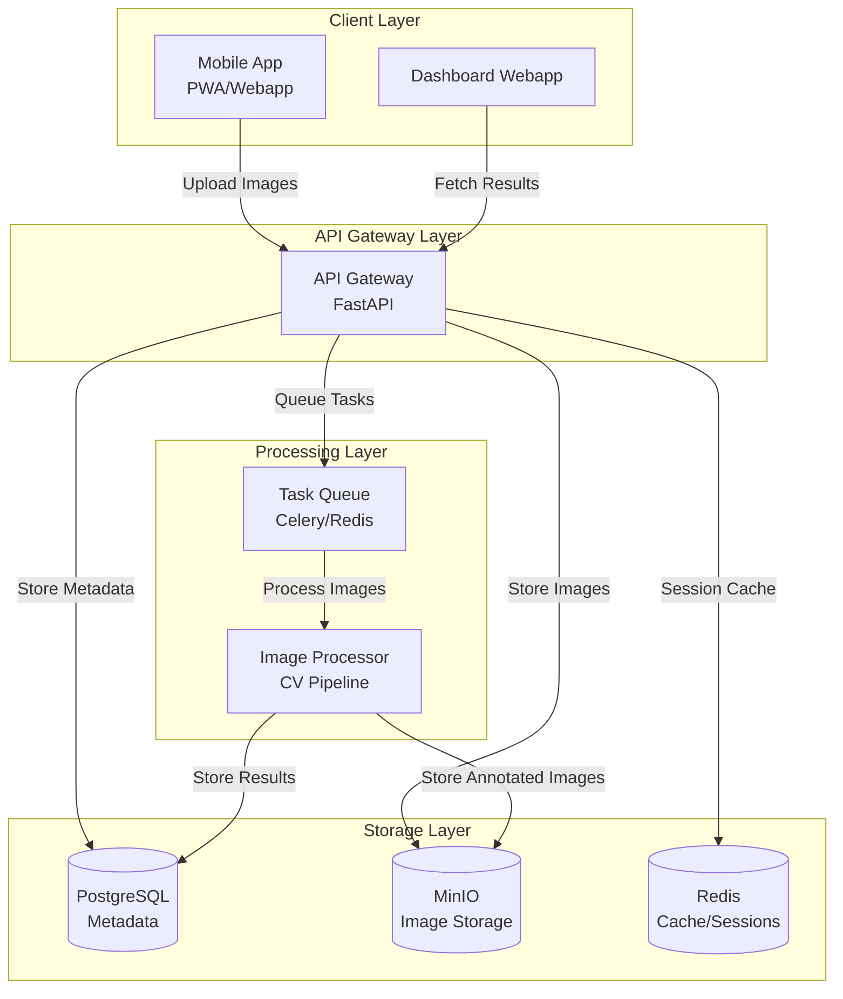
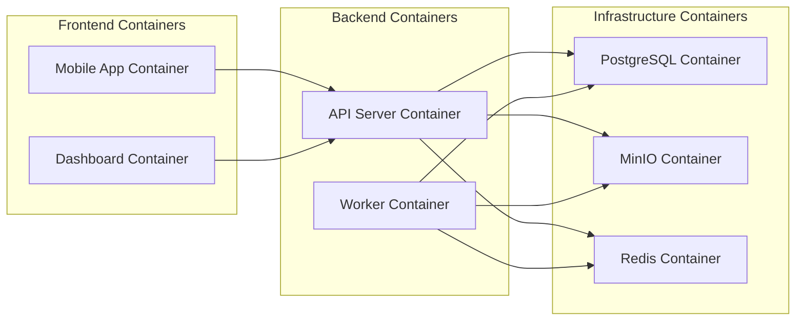
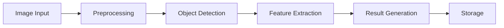
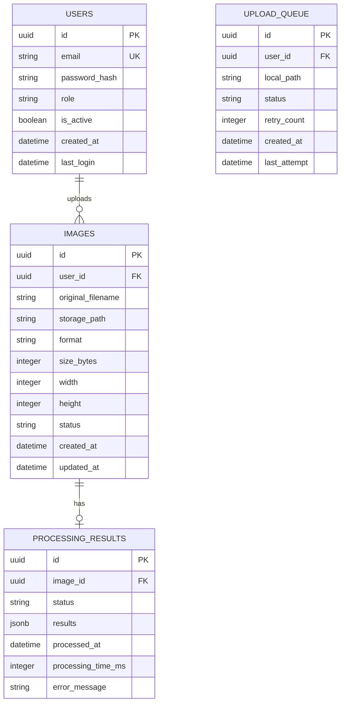
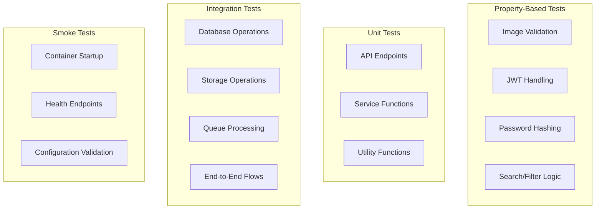
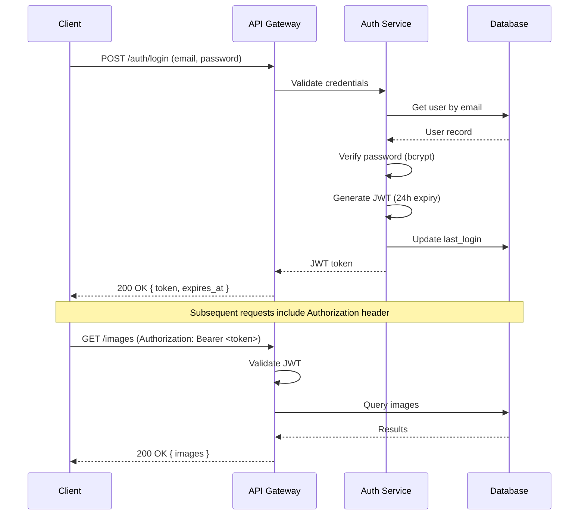
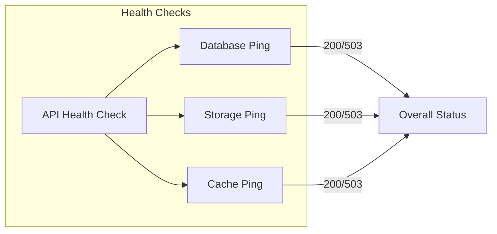

# Design Document: Hershey's CV System

## Overview

The Hershey's Computer Vision (CV) System is a full-stack image processing platform that enables field operators to capture product images via mobile devices, process them through a backend computer vision pipeline, and visualize results through a web-based dashboard. The system follows Hershey's brand guidelines and is fully containerized for consistent deployment.

### System Goals

1. **Mobile Image Capture**: Provide an intuitive mobile interface for field operators to capture and upload product images
2. **Backend Processing**: Process uploaded images through a computer vision pipeline with robust error handling
3. **Dashboard Visualization**: Display processing results and analytics to Hershey's analysts
4. **DevOps Excellence**: Ensure reproducible deployments through Docker containerization, UV package management, and Ruff linting

### Key Design Decisions

| Decision | Rationale |
|----------|-----------|
| Mobile app as responsive webapp (PWA) | Faster development, cross-platform support, easier Docker containerization |
| FastAPI for backend | High performance, async support, automatic API documentation |
| PostgreSQL + MinIO for storage | Relational data for metadata, object storage for images |
| JWT-based authentication | Stateless, scalable, suitable for mobile clients |
| Multi-stage Docker builds | Minimize image sizes, improve deployment efficiency |

---

## Architecture

### High-Level Architecture



### Component Architecture



### Technology Stack

| Component | Technology | Version | Purpose |
|-----------|------------|---------|---------|
| Mobile App | React + PWA | 18.x | Responsive mobile interface |
| Dashboard | React + TypeScript | 18.x | Admin dashboard for analysts |
| Backend API | FastAPI | 0.109+ | REST API and image processing coordination |
| Image Processor | OpenCV + Python | 4.x | Computer vision pipeline |
| Task Queue | Celery + Redis | 5.x | Asynchronous image processing |
| Database | PostgreSQL | 16.x | Metadata and user data |
| Object Storage | MinIO | Latest | Image and artifact storage |
| Cache | Redis | 7.x | Session storage and caching |
| Package Manager | UV | Latest | Python dependency management |
| Linter/Formatter | Ruff | Latest | Code quality enforcement |
| Container Runtime | Docker + Compose | 24.x | Containerization and orchestration |

---

## Components and Interfaces

### 1. Mobile App (PWA)

#### Responsibility
Provides the field operator interface for capturing and uploading product images with Hershey's branding.

#### Directory Structure

```
mobile-app/
├── src/
│   ├── components/
│   │   ├── CameraCapture/     # Camera interface component
│   │   ├── UploadQueue/       # Offline upload queue
│   │   ├── ImagePreview/      # Image preview with confirmation
│   │   └── UI/                # Hershey's branded UI components
│   ├── hooks/
│   │   ├── useCamera.ts       # Camera access hook
│   │   ├── useUpload.ts       # Upload with retry logic
│   │   └── useOffline.ts      # Offline detection and queue
│   ├── services/
│   │   ├── api.ts             # Backend API client
│   │   └── storage.ts         # Local storage for offline
│   ├── styles/
│   │   └── hershey-theme.ts   # Hershey's brand colors
│   └── App.tsx
├── Dockerfile
└── package.json
```

#### Key Interfaces

**Camera Capture Interface**
```typescript
interface CameraCaptureProps {
  onCapture: (image: CapturedImage) => void;
  maxResolution: { width: number; height: number };
  theme: HersheyTheme;
}

interface CapturedImage {
  blob: Blob;
  timestamp: Date;
  location?: GeoLocation;
  deviceId: string;
}
```

**Upload Service Interface**
```typescript
interface UploadService {
  upload(image: CapturedImage, onProgress: (p: number) => void): Promise<UploadResult>;
  queueForRetry(image: CapturedImage): void;
  getQueueStatus(): QueuedImage[];
}

interface UploadResult {
  success: boolean;
  imageId?: string;
  error?: string;
}
```

### 2. Backend API Service

#### Responsibility
Handles API requests, authentication, image validation, and task coordination.

#### Directory Structure

```
backend/
├── app/
│   ├── api/
│   │   ├── routes/
│   │   │   ├── auth.py        # Authentication endpoints
│   │   │   ├── images.py      # Image upload/retrieval
│   │   │   ├── results.py     # Processing results
│   │   │   └── health.py      # Health check endpoints
│   │   └── dependencies.py    # Request dependencies
│   ├── core/
│   │   ├── config.py          # Configuration management
│   │   ├── security.py        # JWT, password hashing
│   │   └── logging.py         # Logging configuration
│   ├── models/
│   │   ├── user.py            # User model
│   │   ├── image.py           # Image metadata model
│   │   └── result.py          # Processing result model
│   ├── services/
│   │   ├── storage.py         # MinIO storage service
│   │   ├── queue.py           # Celery task queue
│   │   └── cache.py           # Redis cache service
│   ├── tasks/
│   │   └── process_image.py   # Celery tasks
│   └── main.py
├── tests/
├── Dockerfile
├── pyproject.toml
└── .python-version
```

#### API Endpoints

| Method | Endpoint | Description | Auth Required |
|--------|----------|-------------|---------------|
| POST | `/api/v1/auth/login` | User login | No |
| POST | `/api/v1/auth/refresh` | Refresh JWT token | Yes |
| POST | `/api/v1/images` | Upload image | Yes |
| GET | `/api/v1/images` | List images (paginated) | Yes |
| GET | `/api/v1/images/{id}` | Get image details | Yes |
| GET | `/api/v1/results` | List processing results | Yes |
| GET | `/api/v1/results/{id}` | Get specific result | Yes |
| GET | `/health` | Health check | No |

#### Request/Response Schemas

**Image Upload Request**
```python
class ImageUploadRequest(BaseModel):
    file: UploadFile
    metadata: Optional[dict] = None

class ImageUploadResponse(BaseModel):
    id: UUID
    status: ImageStatus
    message: str
    created_at: datetime
```

**Processing Result Response**
```python
class ProcessingResult(BaseModel):
    id: UUID
    image_id: UUID
    status: ProcessingStatus
    results: Optional[dict]
    processed_at: Optional[datetime]
    error_message: Optional[str]
    processing_time_ms: Optional[int]
```

### 3. Image Processor

#### Responsibility
Performs computer vision analysis on uploaded images asynchronously.

#### Processing Pipeline



#### Components

```python
# tasks/process_image.py

@celery_app.task(bind=True, max_retries=3)
def process_image(self, image_id: str):
    """
    Asynchronous image processing task.
    
    Pipeline:
    1. Fetch image from MinIO
    2. Validate image integrity
    3. Run CV pipeline (placeholder for actual CV logic)
    4. Store results in PostgreSQL
    5. Update image status
    """
    pass
```

#### Processing Configuration
```python
class ProcessingConfig(BaseModel):
    max_image_size_mb: int = 10
    supported_formats: list[str] = ["JPEG", "PNG"]
    max_processing_time_seconds: int = 60
    retry_attempts: int = 3
    retry_delay_seconds: int = 5
```

### 4. Dashboard Webapp

#### Responsibility
Provides analysts with a visual interface to view processing results, filter data, and analyze outputs.

#### Directory Structure

```
dashboard/
├── src/
│   ├── components/
│   │   ├── Dashboard/         # Main dashboard layout
│   │   ├── ImageGallery/      # Image grid display
│   │   ├── ResultDetail/      # Processing result detail view
│   │   ├── Filters/           # Date range, status filters
│   │   ├── Search/            # Search functionality
│   │   └── UI/                # Hershey's branded components
│   ├── hooks/
│   │   ├── useResults.ts      # Fetch results with pagination
│   │   ├── useFilters.ts      # Filter state management
│   │   └── useSearch.ts       # Search functionality
│   ├── services/
│   │   └── api.ts             # Backend API client
│   ├── styles/
│   │   └── hershey-theme.ts   # Hershey's brand colors
│   └── App.tsx
├── Dockerfile
└── package.json
```

#### Key Interfaces

**Dashboard State**
```typescript
interface DashboardState {
  results: ProcessingResult[];
  filters: FilterState;
  pagination: PaginationState;
  loading: boolean;
  error: string | null;
}

interface FilterState {
  dateRange: [Date, Date] | null;
  status: ProcessingStatus | null;
  searchQuery: string;
}
```

### 5. Storage Service (MinIO)

#### Responsibility
Object storage for images and processing artifacts.

#### Bucket Structure

```
hersheys-cv-storage/
├── uploads/              # Original uploaded images
│   └── {year}/{month}/{day}/{image_id}.jpg
├── processed/            # Processed/annotated images
│   └── {year}/{month}/{day}/{image_id}_processed.jpg
└── exports/              # Export artifacts
    └── {export_id}.zip
```

### 6. Database (PostgreSQL)

#### Responsibility
Persistent storage for metadata, users, and processing results.

---

## Data Models

### Entity Relationship Diagram



### Database Schema

```sql
-- Users table
CREATE TABLE users (
    id UUID PRIMARY KEY DEFAULT gen_random_uuid(),
    email VARCHAR(255) UNIQUE NOT NULL,
    password_hash VARCHAR(255) NOT NULL,
    role VARCHAR(50) DEFAULT 'operator',
    is_active BOOLEAN DEFAULT true,
    failed_login_attempts INTEGER DEFAULT 0,
    locked_until TIMESTAMP,
    created_at TIMESTAMP DEFAULT CURRENT_TIMESTAMP,
    last_login TIMESTAMP
);

-- Images table
CREATE TABLE images (
    id UUID PRIMARY KEY DEFAULT gen_random_uuid(),
    user_id UUID REFERENCES users(id) ON DELETE CASCADE,
    original_filename VARCHAR(255) NOT NULL,
    storage_path VARCHAR(500) NOT NULL,
    format VARCHAR(10) NOT NULL,
    size_bytes INTEGER NOT NULL,
    width INTEGER,
    height INTEGER,
    status VARCHAR(50) DEFAULT 'pending',
    created_at TIMESTAMP DEFAULT CURRENT_TIMESTAMP,
    updated_at TIMESTAMP DEFAULT CURRENT_TIMESTAMP
);

-- Processing results table
CREATE TABLE processing_results (
    id UUID PRIMARY KEY DEFAULT gen_random_uuid(),
    image_id UUID REFERENCES images(id) ON DELETE CASCADE,
    status VARCHAR(50) DEFAULT 'pending',
    results JSONB,
    processed_at TIMESTAMP,
    processing_time_ms INTEGER,
    error_message TEXT,
    created_at TIMESTAMP DEFAULT CURRENT_TIMESTAMP
);

-- Indexes for performance
CREATE INDEX idx_images_user_id ON images(user_id);
CREATE INDEX idx_images_status ON images(status);
CREATE INDEX idx_images_created_at ON images(created_at DESC);
CREATE INDEX idx_results_status ON processing_results(status);
CREATE INDEX idx_results_processed_at ON processing_results(processed_at DESC);

-- Audit log table
CREATE TABLE audit_logs (
    id UUID PRIMARY KEY DEFAULT gen_random_uuid(),
    user_id UUID REFERENCES users(id),
    action VARCHAR(100) NOT NULL,
    resource_type VARCHAR(50),
    resource_id UUID,
    details JSONB,
    ip_address INET,
    created_at TIMESTAMP DEFAULT CURRENT_TIMESTAMP
);
```

---

## Correctness Properties

*A property is a characteristic or behavior that should hold true across all valid executions of a system—essentially, a formal statement about what the system should do. Properties serve as the bridge between human-readable specifications and machine-verifiable correctness guarantees.*

**PBT Applicability Assessment:**

This system has mixed PBT applicability:
- **Docker containerization**: NOT suitable for PBT (IaC) — use smoke tests
- **UI rendering**: NOT suitable for PBT — use snapshot tests and visual regression
- **Image validation logic**: Suitable for PBT
- **JWT token handling**: Suitable for PBT
- **Password hashing**: Suitable for PBT
- **Search/filter logic**: Suitable for PBT

### Property 1: Image Compression Preserves Aspect Ratio

*For any* input image with dimensions (w, h), after compression to ≤ 5MB, the output image SHALL have the same aspect ratio w/h.

**Validates: Requirements 2.2**

### Property 2: Image Format Validation Correctness

*For any* byte sequence, the format validator SHALL correctly identify:
- Valid JPEG files (starting with FF D8 FF)
- Valid PNG files (starting with 89 50 4E 47)
- Invalid formats (everything else)

**Validates: Requirements 3.2, 3.3**

### Property 3: Image Size Validation

*For any* file with size s:
- If s ≤ 10MB, the validator SHALL accept the file
- If s > 10MB, the validator SHALL reject the file with HTTP 413

**Validates: Requirements 3.4**

### Property 4: Unique Image Identifiers

*For any* two distinct valid images uploaded, the assigned identifiers SHALL be unique (no collisions).

**Validates: Requirements 3.5**

### Property 5: JWT Token Expiration

*For any* JWT token issued at time t, the `exp` claim SHALL equal t + 24 hours (± 1 minute tolerance for clock skew).

**Validates: Requirements 11.3**

### Property 6: Token Refresh Window

*For any* JWT token with issue time t:
- At time t + d where d < 7 days, refresh SHALL be allowed
- At time t + d where d ≥ 7 days, refresh SHALL be denied

**Validates: Requirements 11.4**

### Property 7: Password Hashing Algorithm

*For any* password string, the resulting hash SHALL:
- Be a valid bcrypt hash
- Have a cost factor ≥ 12
- Be verifiable against the original password

**Validates: Requirements 11.5**

### Property 8: Account Lockout Threshold

*For any* account, after exactly 5 consecutive failed authentication attempts:
- The account SHALL be locked for 15 minutes
- Subsequent authentication attempts during lockout SHALL fail

**Validates: Requirements 11.6**

### Property 9: Search Results Match Query

*For any* dataset of results and any search query q, all returned results SHALL contain q as a substring in at least one searchable field.

**Validates: Requirements 6.1**

### Property 10: Date Range Filter Correctness

*For any* dataset and any date range [start, end], all filtered results SHALL have `processed_at` in the range [start, end].

**Validates: Requirements 6.2**

### Property 11: Status Filter Correctness

*For any* dataset and any status filter value s, all filtered results SHALL have `status` equal to s.

**Validates: Requirements 6.3**

### Property 12: Recent Results Pagination

*For any* dataset with N ≥ 10 results, the dashboard SHALL return exactly 10 results sorted by `created_at` descending.

**Validates: Requirements 5.2**

### Property 13: Processing Results Reference Integrity

*For any* processing result, the `image_id` field SHALL reference a valid, existing image in the images table.

**Validates: Requirements 4.3**

### Property 14: Error Messages Sanitization

*For any* internal error (database errors, file system errors, etc.), the returned error message SHALL NOT contain:
- Stack traces
- Internal file paths
- Database connection strings
- Environment variable values

**Validates: Requirements 12.2**

---

## Error Handling

### Error Response Format

All API errors follow a consistent format:

```python
class ErrorResponse(BaseModel):
    error: str              # Short error code (e.g., "VALIDATION_ERROR")
    message: str            # User-friendly message
    request_id: str         # For debugging
    timestamp: datetime
```

### Error Categories

| Category | HTTP Status | Example Errors |
|----------|-------------|----------------|
| Validation | 400 | Invalid image format, missing required fields |
| Authentication | 401 | Missing token, expired token, invalid token |
| Authorization | 403 | Insufficient permissions |
| Not Found | 404 | Image not found, user not found |
| Payload Too Large | 413 | Image exceeds 10MB limit |
| Rate Limited | 429 | Too many requests |
| Internal Error | 500 | Database errors, processing failures |
| Service Unavailable | 503 | Dependent service unhealthy |

### Logging Standards

```python
# Log format
{
    "timestamp": "2024-01-15T10:30:00Z",
    "level": "ERROR",
    "component": "api_gateway",
    "message": "Image validation failed",
    "request_id": "abc-123",
    "user_id": "user-456",
    "details": {
        "error_code": "INVALID_FORMAT",
        "file_format": "BMP"
    },
    "stack_trace": "..."
}
```

---

## Testing Strategy

### Test Categories



### Property-Based Testing Configuration

**Library**: Hypothesis (Python) for backend, fast-check (TypeScript) for frontend

**Configuration**:
- Minimum 100 iterations per property test
- Each test tagged with design property reference
- Tag format: `Feature: hersheys-cv-system, Property {number}: {property_text}`

### Test Distribution

| Test Type | Count (Est.) | Coverage Target |
|-----------|--------------|-----------------|
| Property Tests | 14 | Core business logic |
| Unit Tests | 50+ | Individual functions and components |
| Integration Tests | 20+ | Service interactions |
| Smoke Tests | 10+ | Container and configuration validation |
| E2E Tests | 10+ | Critical user flows |

### CI/CD Integration

```yaml
# .github/workflows/ci.yml (conceptual)
stages:
  - lint
  - unit-tests
  - property-tests
  - integration-tests
  - build
  - smoke-tests

lint:
  - ruff check backend/
  - ruff format --check backend/
  - eslint frontend/

property-tests:
  - pytest tests/property/ -n 100

integration-tests:
  - docker-compose up -d
  - pytest tests/integration/
  - docker-compose down
```

---

## Security Design

### Authentication Flow



### Security Measures

| Layer | Measure | Implementation |
|-------|---------|----------------|
| Transport | TLS 1.3 | All endpoints served over HTTPS |
| Authentication | JWT + bcrypt | 24-hour token expiry, bcrypt cost ≥ 12 |
| Authorization | Role-based | operator, analyst, admin roles |
| Input Validation | Strict schemas | Pydantic models for all inputs |
| Rate Limiting | Token bucket | 100 requests/minute per user |
| Error Handling | Sanitization | No internal details exposed |
| Logging | Audit trail | All actions logged with user context |

### Password Security

```python
# Password hashing configuration
PASSWORD_HASH_ALGORITHM = "bcrypt"
PASSWORD_HASH_COST = 12  # Minimum cost factor
PASSWORD_MIN_LENGTH = 8
PASSWORD_REQUIREMENTS = [
    "at least one uppercase letter",
    "at least one lowercase letter",
    "at least one digit",
    "at least one special character"
]
```

### Default User Configuration

The system SHALL be initialized with a default dashboard user for authentication:

```python
# Default dashboard credentials (stored as bcrypt hash in database)
DEFAULT_DASHBOARD_USER = {
    "username": "hersheys",
    "password": "cv-hersheys",  # Will be hashed with bcrypt on initialization
    "role": "analyst",
    "is_active": True
}
```

**Implementation Notes:**
- The default user SHALL be created during database initialization/migration
- The password SHALL be stored as a bcrypt hash, NOT in plain text
- The default user credentials SHALL be documented in the README.md for initial access
- Users SHALL be able to change the default password after first login

---

## Deployment Architecture

### Docker Compose Configuration

```yaml
# docker-compose.yml (conceptual structure)
services:
  # Frontend Services
  mobile-app:
    build:
      context: ./mobile-app
      dockerfile: Dockerfile
    ports:
      - "3000:80"
    depends_on:
      - api
    healthcheck:
      test: ["CMD", "curl", "-f", "http://localhost:80/health"]
      interval: 30s
      timeout: 10s
      retries: 3

  dashboard:
    build:
      context: ./dashboard
      dockerfile: Dockerfile
    ports:
      - "3001:80"
    depends_on:
      - api
    healthcheck:
      test: ["CMD", "curl", "-f", "http://localhost:80/health"]
      interval: 30s
      timeout: 10s
      retries: 3

  # Backend Services
  api:
    build:
      context: ./backend
      dockerfile: Dockerfile
    ports:
      - "8000:8000"
    environment:
      - DATABASE_URL=postgresql://user:pass@db:5432/hersheys_cv
      - REDIS_URL=redis://redis:6379
      - MINIO_URL=http://storage:9000
    depends_on:
      db:
        condition: service_healthy
      redis:
        condition: service_started
      storage:
        condition: service_started
    healthcheck:
      test: ["CMD", "curl", "-f", "http://localhost:8000/health"]
      interval: 30s
      timeout: 10s
      retries: 3

  worker:
    build:
      context: ./backend
      dockerfile: Dockerfile.worker
    environment:
      - DATABASE_URL=postgresql://user:pass@db:5432/hersheys_cv
      - REDIS_URL=redis://redis:6379
      - MINIO_URL=http://storage:9000
    depends_on:
      - api
      - db
      - redis
      - storage

  # Infrastructure Services
  db:
    image: postgres:16
    volumes:
      - postgres_data:/var/lib/postgresql/data
    healthcheck:
      test: ["CMD-SHELL", "pg_isready -U user -d hersheys_cv"]
      interval: 10s
      timeout: 5s
      retries: 5

  storage:
    image: minio/minio
    command: server /data --console-address ":9001"
    volumes:
      - minio_data:/data
    healthcheck:
      test: ["CMD", "curl", "-f", "http://localhost:9000/minio/health/live"]
      interval: 30s
      timeout: 20s
      retries: 3

  redis:
    image: redis:7-alpine
    volumes:
      - redis_data:/data
    healthcheck:
      test: ["CMD", "redis-cli", "ping"]
      interval: 10s
      timeout: 5s
      retries: 5

volumes:
  postgres_data:
  minio_data:
  redis_data:
```

### Multi-Stage Dockerfile Example (Backend)

```dockerfile
# Build stage
FROM python:3.12-slim AS builder

WORKDIR /app

# Install UV
COPY --from=ghcr.io/astral-sh/uv:latest /uv /usr/local/bin/uv

# Copy dependency files
COPY pyproject.toml uv.lock .python-version ./

# Install dependencies
RUN uv sync --frozen --no-install-project

# Production stage
FROM python:3.12-slim AS production

WORKDIR /app

# Copy virtual environment from builder
COPY --from=builder /app/.venv /app/.venv

# Copy application code
COPY ./app ./app

# Run with UV
ENV PATH="/app/.venv/bin:$PATH"
CMD ["uv", "run", "fastapi", "run", "app/main.py", "--host", "0.0.0.0"]
```

### Project Structure

```
cv-hersheys/
├── mobile-app/                # Mobile PWA
│   ├── src/
│   ├── public/
│   ├── Dockerfile
│   └── package.json
├── dashboard/                 # Dashboard webapp
│   ├── src/
│   ├── public/
│   ├── Dockerfile
│   └── package.json
├── backend/                   # FastAPI backend
│   ├── app/
│   ├── tests/
│   ├── Dockerfile
│   ├── Dockerfile.worker
│   ├── pyproject.toml
│   ├── uv.lock
│   └── .python-version
├── docker-compose.yml
├── docker-compose.prod.yml
├── .gitignore
├── README.md
└── LICENSE
```

---

## API Specifications

### Authentication Endpoints

#### POST /api/v1/auth/login

**Default Dashboard Credentials:**
- Username: `hersheys`
- Password: `cv-hersheys`

**Request:**
```json
{
  "email": "hersheys",
  "password": "cv-hersheys"
}
```

**Response (200 OK):**
```json
{
  "access_token": "eyJhbGciOiJIUzI1NiIs...",
  "token_type": "bearer",
  "expires_at": "2024-01-16T10:30:00Z",
  "user": {
    "id": "uuid",
    "email": "hersheys",
    "role": "analyst"
  }
}
```

**Response (401 Unauthorized):**
```json
{
  "error": "INVALID_CREDENTIALS",
  "message": "Invalid email or password",
  "request_id": "req-abc-123",
  "timestamp": "2024-01-15T10:30:00Z"
}
```

#### POST /api/v1/auth/refresh

**Request Headers:**
```
Authorization: Bearer <current_token>
```

**Response (200 OK):**
```json
{
  "access_token": "eyJhbGciOiJIUzI1NiIs...",
  "token_type": "bearer",
  "expires_at": "2024-01-16T11:30:00Z"
}
```

### Image Endpoints

#### POST /api/v1/images

**Request (multipart/form-data):**
```
file: <binary image data>
metadata: {"location": "Warehouse A", "notes": "Sample image"}
```

**Response (201 Created):**
```json
{
  "id": "550e8400-e29b-41d4-a716-446655440000",
  "status": "pending",
  "message": "Image uploaded successfully and queued for processing",
  "created_at": "2024-01-15T10:30:00Z"
}
```

#### GET /api/v1/images

**Query Parameters:**
| Parameter | Type | Default | Description |
|-----------|------|---------|-------------|
| page | int | 1 | Page number |
| limit | int | 20 | Items per page (max 100) |
| status | string | null | Filter by status |
| start_date | date | null | Filter from date |
| end_date | date | null | Filter to date |

**Response (200 OK):**
```json
{
  "items": [
    {
      "id": "550e8400-e29b-41d4-a716-446655440000",
      "original_filename": "product_001.jpg",
      "status": "processed",
      "created_at": "2024-01-15T10:30:00Z",
      "thumbnail_url": "https://storage/thumbnails/..."
    }
  ],
  "total": 150,
  "page": 1,
  "limit": 20,
  "pages": 8
}
```

### Results Endpoints

#### GET /api/v1/results/{id}

**Response (200 OK):**
```json
{
  "id": "660e8400-e29b-41d4-a716-446655440001",
  "image_id": "550e8400-e29b-41d4-a716-446655440000",
  "status": "completed",
  "results": {
    "objects_detected": 5,
    "confidence_score": 0.95,
    "annotations": [...]
  },
  "processed_at": "2024-01-15T10:31:00Z",
  "processing_time_ms": 2345
}
```

### Health Endpoints

#### GET /health

**Response (200 OK - Healthy):**
```json
{
  "status": "healthy",
  "timestamp": "2024-01-15T10:30:00Z",
  "services": {
    "database": "healthy",
    "storage": "healthy",
    "cache": "healthy"
  }
}
```

**Response (503 Service Unavailable - Unhealthy):**
```json
{
  "status": "unhealthy",
  "timestamp": "2024-01-15T10:30:00Z",
  "services": {
    "database": "healthy",
    "storage": "unhealthy",
    "cache": "healthy"
  },
  "details": "Storage service not responding"
}
```

---

## Hershey's Brand Integration

### Color Palette

```typescript
// Hershey's brand colors
export const hersheyTheme = {
  colors: {
    chocolateBrown: '#3E000F',   // Primary - buttons, headers
    darkSienna: '#381216',       // Secondary - navigation, accents
    silver: '#A8A9AD',           // Neutral - borders, disabled states
    white: '#FFFFFF',            // Background - cards, inputs
  },
  typography: {
    fontFamily: "'Hershey', 'Helvetica Neue', sans-serif",
    headingWeight: 700,
    bodyWeight: 400,
  },
  components: {
    button: {
      primary: {
        bg: '#3E000F',
        text: '#FFFFFF',
        hover: '#381216',
      },
      secondary: {
        bg: '#A8A9AD',
        text: '#3E000F',
        hover: '#8A8B8D',
      },
    },
    card: {
      bg: '#FFFFFF',
      border: '#A8A9AD',
      shadow: '0 2px 4px rgba(62, 0, 15, 0.1)',
    },
    navigation: {
      bg: '#381216',
      text: '#FFFFFF',
      active: '#3E000F',
    },
  },
};
```

### Component Examples

**Mobile Camera Button:**
```tsx
<CaptureButton
  style={{
    backgroundColor: hersheyTheme.colors.chocolateBrown,
    color: hersheyTheme.colors.white,
    borderRadius: '50%',
    width: 72,
    height: 72,
  }}
/>
```

**Dashboard Header:**
```tsx
<Header
  style={{
    backgroundColor: hersheyTheme.colors.darkSienna,
    color: hersheyTheme.colors.white,
  }}
/>
```

---

## Monitoring and Observability

### Health Check Strategy



### Logging Strategy

| Log Level | Use Case | Example |
|-----------|----------|---------|
| DEBUG | Development troubleshooting | Variable values, flow tracing |
| INFO | Normal operations | Request received, task started |
| WARNING | Recoverable issues | Slow query, retry attempt |
| ERROR | Failed operations | Processing failure, auth error |
| CRITICAL | System failures | Database connection lost |

### Metrics Collection

```python
# Key metrics to track
METRICS = [
    # Request metrics
    "api_requests_total",
    "api_request_duration_seconds",
    "api_request_size_bytes",
    
    # Image processing metrics
    "images_uploaded_total",
    "images_processed_total",
    "processing_duration_seconds",
    "processing_errors_total",
    
    # Storage metrics
    "storage_used_bytes",
    "storage_objects_total",
    
    # Authentication metrics
    "auth_attempts_total",
    "auth_failures_total",
    "active_sessions_total",
]
```

---

## Appendices

### A. Environment Variables

| Variable | Description | Default |
|----------|-------------|---------|
| `DATABASE_URL` | PostgreSQL connection string |{}
 Required |
| `REDIS_URL` | Redis connection string | `redis://localhost:6379` |
| `MINIO_URL` | MinIO endpoint | `http://localhost:9000` |
| `MINIO_ACCESS_KEY` | MinIO access key | Required |
| `MINIO_SECRET_KEY` | MinIO secret key | Required |
| `JWT_SECRET_KEY` | JWT signing key | Required |
| `JWT_ALGORITHM` | JWT algorithm | `HS256` |
| `JWT_EXPIRATION_HOURS` | Token expiry time | `24` |
| `REFRESH_TOKEN_EXPIRATION_DAYS` | Refresh window | `7` |
| `BCRYPT_COST` | Password hash cost factor | `12` |
| `MAX_IMAGE_SIZE_MB` | Max upload size | `10` |
| `LOG_LEVEL` | Logging level | `INFO` |

### B. Ruff Configuration

```toml
# pyproject.toml
[tool.ruff]
target-version = "py312"
line-length = 100

[tool.ruff.lint]
select = [
    "E",   # pycodestyle errors
    "W",   # pycodestyle warnings
    "F",   # Pyflakes
    "I",   # isort
    "B",   # flake8-bugbear
    "C4",  # flake8-comprehensions
    "UP",  # pyupgrade
    "ARG", # flake8-unused-arguments
    "SIM", # flake8-simplify
]

[tool.ruff.format]
quote-style = "double"
indent-style = "space"
skip-magic-trailing-comma = false
line-ending = "auto"
```

### C. UV Configuration

```toml
# pyproject.toml
[project]
name = "hersheys-cv-backend"
version = "0.1.0"
description = "Hershey's CV System Backend"
readme = "README.md"
requires-python = ">=3.12"
dependencies = [
    "fastapi>=0.109.0",
    "uvicorn[standard]>=0.27.0",
    "pydantic>=2.5.0",
    "pydantic-settings>=2.1.0",
    "sqlalchemy>=2.0.0",
    "asyncpg>=0.29.0",
    "celery>=5.3.0",
    "redis>=5.0.0",
    "minio>=7.2.0",
    "python-jose[cryptography]>=3.3.0",
    "passlib[bcrypt]>=1.7.4",
    "python-multipart>=0.0.6",
    "opencv-python-headless>=4.9.0",
    "numpy>=1.26.0",
    "pillow>=10.2.0",
]

[project.optional-dependencies]
dev = [
    "pytest>=8.0.0",
    "pytest-asyncio>=0.23.0",
    "pytest-cov>=4.1.0",
    "hypothesis>=6.97.0",
    "httpx>=0.26.0",
    "ruff>=0.1.0",
    "mypy>=1.8.0",
]

[build-system]
requires = ["hatchling"]
build-backend = "hatchling.build"
```

### D. .gitignore

```gitignore
# Python
__pycache__/
*.py[cod]
*$py.class
*.so
.Python
build/
develop-eggs/
dist/
downloads/
eggs/
.eggs/
lib/
lib64/
parts/
sdist/
var/
wheels/
*.egg-info/
.installed.cfg
*.egg

# Virtual environments
.venv/
venv/
ENV/
env/

# UV
.uv/

# IDE
.idea/
.vscode/
*.swp
*.swo
*~

# Environment variables
.env
.env.local
.env.*.local

# Logs
logs/
*.log

# Database
*.db
*.sqlite3

# Docker
.docker/

# Node.js (for frontends)
node_modules/
npm-debug.log*
yarn-debug.log*
yarn-error.log*

# Build outputs
dist/
build/
.next/
out/

# Testing
.coverage
htmlcov/
.pytest_cache/
.hypothesis/

# OS
.DS_Store
Thumbs.db
```

---

## Summary

This design document outlines a comprehensive architecture for the Hershey's Computer Vision System, covering:

1. **High-level architecture** with clear separation between client, API, processing, and storage layers
2. **Component design** with detailed interfaces for mobile app, backend API, image processor, and dashboard
3. **Data models** with full database schema and entity relationships
4. **API specifications** with complete endpoint definitions and request/response schemas
5. **Security design** with JWT authentication, password hashing, and role-based authorization
6. **Deployment architecture** with Docker Compose and multi-stage Dockerfiles
7. **Hershey's brand integration** with complete color palette and component styling
8. **Monitoring and observability** with health checks, logging, and metrics
9. **Testing strategy** with 14 property-based tests covering core business logic

The system follows the requirements-first workflow and addresses all 13 requirements from the requirements document.
